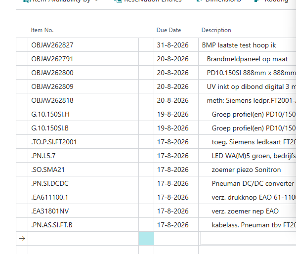
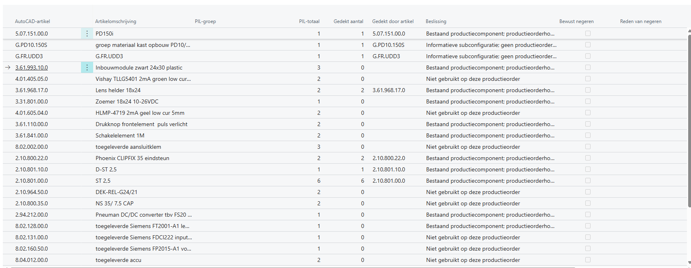
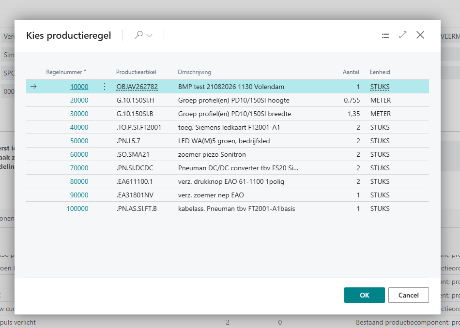
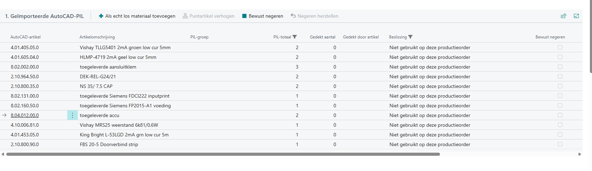
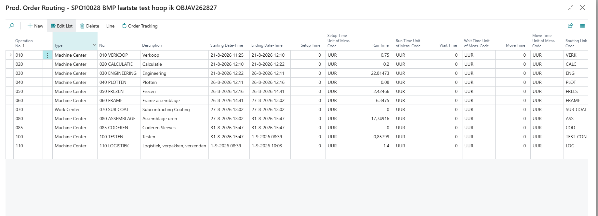
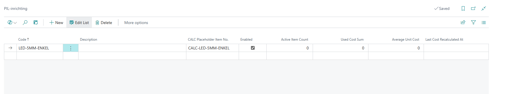

# Handleiding AutoCAD-PIL en productieorder

## Doel

Met **PNE Production Order Reconciliation** vergelijkt u een headerloze
AutoCAD-PIL met een bestaande Business Central-productieorder. De app laat zien
wat al door de order wordt gedekt, welke carriers moeten veranderen en welke
artikelen nog een bewuste keuze vragen. Pas na controle wordt het voorstel in
één transactie op de productieorder toegepast.

De uitbreiding werkt op gesimuleerde, vast geplande en vrijgegeven
productieorders. Ze gebruikt alleen standaard Business Central-artikel-, BOM-,
productieorder-, component-, routing- en verkoopvelden. Er is geen technische
afhankelijkheid van IWX.

## Rechten en voorbereiding

### Rollen

- Dagelijks verwerken: **PNE PIL verwerken** (`PNE PIL Reconcile`).
- Inrichting onderhouden: **PNE PIL Setup**.
- Alleen BOM-stamstructuur bekijken: **PNE productiestructuur bekijken**
  (`PNE PO Struct View`).
- Netto verschillen naar een offerte zetten: daarnaast de normale
  verkoopofferte-rechten.

### Controle vóór de eerste test

- [ ] De actuele PIL-app is geïnstalleerd.
- [ ] De productieorder bestaat en heeft status Gesimuleerd, Vast gepland of
  Vrijgegeven.
- [ ] De productieorder is vernieuwd en bevat de verwachte productieregels en
  componenten.
- [ ] De gebruikte productie-BOM's en versies zijn gecertificeerd.
- [ ] De te wijzigen regels hebben nog geen verbruik, picks, output of
  reserveringen.
- [ ] AutoCAD-artikelnummers bestaan als Business Central-artikel als ze echt
  moeten worden verwerkt.
- [ ] PIL-gestuurde carriers en materiaalregels gebruiken **STUKS** met factor
  1. Profiel-, plaat- en uurregels in andere eenheden mogen wel in de order
  staan, maar zijn geen PIL-carrier.

## Bestandsformaat uit AutoCAD

Het bestand heeft geen kopregel. Iedere regel bevat exact vier velden tussen
enkele aanhalingstekens:

```text
'artikelnummer','technisch kenmerk','positie','aantal'
'4.01.205.04.0','-GL','','4'
```

Belangrijk:

- het artikelnummer mag maximaal 20 tekens zijn;
- het aantal moet positief zijn om als behoefte te worden verwerkt;
- zowel `1,00` als `1.00` wordt eenduidig gelezen;
- meer regels met hetzelfde artikel worden samengevoegd;
- bewaar bij een test altijd een kopie van het exact ingelezen bestand.

## Een PIL verwerken: de normale route

### 1. Importeren en analyseren

1. Open de juiste productieorder.
2. Kies **Functies > AutoCAD-PIL importeren**.
3. Selecteer het PIL-bestand.
4. Het afstemdossier opent automatisch.
5. Kies **Stap 1 - Analyseer PIL**.

De analyse zoekt generiek naar bestaande productiecomponenten, structurele
carriers en ingestelde CALC-placeholders. Een `7.*`, `.PN.*` of ander specifiek
nummer is niet hardgecodeerd. Puntartikelen beginnen in de huidige inrichting
met een punt; geschikte `G.*`-productiecarriers worden alleen gebruikt wanneer
hun artikel- en BOM-eigenschappen dat veilig toelaten.

De normale productieorder toont productieregels plat. In onderstaand voorbeeld
staan hoofdartikel, subconfiguraties en puntartikelen daarom naast elkaar als
productieregels.



### 2. Alleen regels met actie oplossen

Kijk in **1. Geïmporteerde AutoCAD-PIL** vooral naar kolom **Beslissing**.
Regels met een gedekt aantal zijn informatie: de app heeft ze al onder een
hoger artikel of bestaande component herkend. Een regel met **Niet gebruikt op
deze productieorder** vraagt een keuze.



Gebruik één van deze acties:

#### Als echt los materiaal toevoegen

Gebruik dit wanneer het artikel als losse productiecomponent moet worden
toegevoegd en niet onder een bestaand puntartikel hoort.

1. Selecteer één of meer PIL-regels.
2. Kies **Als echt los materiaal toevoegen**.
3. Kies één keer de productieregel waaronder alle geselecteerde artikelen
   horen.
4. De app maakt voor ieder geselecteerd artikel een afzonderlijk voorstel.



Deze actie voegt alleen de gekozen artikelen toe. Eventuele draden, uren en
overige BOM-inhoud komen niet automatisch mee.

#### Puntartikel verhogen

Gebruik dit wanneer het ontbrekende AutoCAD-artikel onderdeel is van een
bestaand samengesteld puntartikel.

1. Selecteer de PIL-regel.
2. Kies **Puntartikel verhogen**.
3. Kies uit de puntartikelen waarvan een geldige Productie-BOM het AutoCAD-
   artikel bevat.
4. Bestaat het puntartikel precies één keer in de productieorder, dan wordt die
   positie automatisch gebruikt.
5. Bestaat het nog niet of meerdere keren, kies dan de juiste productieregel.

De puntartikelroute neemt de volledige geldige BOM-receptuur mee, waaronder
andere materialen en U.-regels. Als een BOM met de juiste naam bestaat maar het
artikelveld **Production BOM No.** nog niet naar die BOM verwijst, kan de app na
bevestiging die koppeling herstellen voordat het voorstel wordt gemaakt.

#### Bewust negeren

Gebruik dit uitsluitend wanneer een positief AutoCAD-artikel echt niet bij deze
productieorder hoort, bijvoorbeeld een informatieve bovenliggende
subconfiguratie die AutoCAD wel exporteert.

U moet altijd een reden invullen. De reden, gebruiker en tijd komen in het
auditrapport. Een al structureel gedekte regel kan niet worden genegeerd.



### 3. Verdeling controleren

Kies **Stap 2 - Controleer verdeling**.

Bij één geldige carrier vult de app **Naar deze carrier** automatisch. Alleen
als hetzelfde AutoCAD-artikel werkelijk over meerdere onafhankelijke carriers
kan worden verdeeld, vult u die kolom handmatig. **Nog te verdelen** moet per
artikel nul zijn.

Als onafhankelijke drivers voor dezelfde carrier verschillende gewenste
aantallen berekenen, verschijnt **Kies carrieraantal**. Vul het definitieve
aantal en een korte, controleerbare reden in. Dit is een bewuste auditkeuze; de
app telt tegenstrijdige drivers nooit stil bij elkaar op.

Na iedere handmatige wijziging krijgt het dossier opnieuw status **Verdeling
vereist**. Kies daarna nogmaals **Stap 2 - Controleer verdeling**. Zo kan een
oud wijzigingsvoorstel niet per ongeluk worden toegepast.

### 4. Wijzigingsvoorstel beoordelen

Kies **Stap 3 - Bekijk wijzigingsvoorstel**.

Controleer minimaal:

- productieorder en importbestand;
- huidig, voorgesteld en verschil per carrier;
- welke AutoCAD-regels iedere wijziging onderbouwen;
- analysebron: actuele productieorder of gecertificeerde master-BOM;
- bewuste uitzonderingen en redenen;
- kostprijsindicatie;
- eventuele commerciële overdracht, terugdraaiing of handmatige vrijgave.

Het rapport is alleen-lezen. Een kostprijsverschil is geen verkoopprijs.

### 5. Veilig toepassen

Kies **Stap 4 - Pas veilig toe** en lees het effectoverzicht.

Vlak vóór schrijven controleert de app opnieuw onder andere:

- of carrier, driver, CALC-bron en BOM nog gelijk zijn aan het voorstel;
- of er geen verbruik, output, picks of reserveringen zijn;
- of geen open productiejournaal of gestarte routing wordt geraakt;
- of de aantallen en eenheden veilig representatief zijn;
- of een eventueel gekoppeld commercieel voorstel nog is toegestaan.

Bij een fout wordt niets gedeeltelijk opgeslagen. Na succes sluit het
afstemdossier en keert u terug naar de productieorder. Het toegepaste dossier
blijft beschikbaar via **Functies > PIL-afstemmingen**.

> [!IMPORTANT]
> Druk niet op **Vernieuwen productieorder** om alleen te kijken. De standaard
> BC-actie kan regels, componenten en routing opnieuw opbouwen. Gebruik haar
> alleen volgens de normale werkvoorbereidingsprocedure.

## Routinguren

Bij veilig toepassen controleert de app het routingeffect van de gewijzigde
actuele U.-componenten. Voor handmatige productiewijzigingen is daarnaast
**Functies > Routinguren opnieuw berekenen** beschikbaar.

De berekening:

- gebruikt actuele productieordercomponenten met een Routing Link Code;
- rekent geneste uren door naar het geproduceerde hoofdartikel;
- zet het volledige nieuwe totaal op de gekoppelde route van het hoofdartikel;
- kan uren verhogen én verlagen;
- laat een optionele route waarvan de huidige tijd bewust nul is op nul en
  meldt welk berekend U.-totaal erachter zit;
- wijzigt geen BluAce-masterrouting of IWX-inrichting.



Controleer na toepassing altijd de voorgestelde oude, nieuwe en verschiluren.
Als een Routing Link Code wel op een U.-component staat maar niet als
productieorderrouting bestaat, kan Business Central de component niet veilig
aan een bewerking koppelen. Laat de routingbron dan herstellen voordat u
vernieuwt of toepast.

## Netto meer- en minderwerk naar een bestaande offerte

De actie **Meer- en minderwerk naar bestaande offerte** vergelijkt de
oorspronkelijke en definitieve carrieraantallen per artikel, variant en eenheid.
Alleen het netto verschil wordt als nieuwe regel op een gekozen open offerte
gezet:

- positief verschil = meerwerk;
- negatief verschil = minderwerk;
- netto nul = geen offertregel.

Bestaande offertregels worden nooit verhoogd of overschreven. Als op het
artikel **Automatische uitgebreide teksten** aanstaat, worden de toepasselijke
standaard uitgebreide artikelteksten onder de nieuwe regel gezet. De tekstregel
bevat het netto aantal en blijft aan de aangemaakte offertregel gekoppeld.

De standaard klantprijs, korting, valuta en btw van de gekozen offerte worden
door Business Central berekend. Controleer deze altijd commercieel.

### Verkeerde offerte gekozen

Zolang de door de app gemaakte artikel- en tekstregels volledig ongewijzigd
zijn en de offerte nog open is, kiest u **Offerteoverdracht terugdraaien**. De
app verwijdert uitsluitend haar eigen regels en bewaart reden, gebruiker, tijd
en oorspronkelijke waarden in het auditdossier.

### Offerte of offertregel is gewijzigd, verwijderd of omgezet

Kan de app de oorspronkelijke koppeling niet meer veilig automatisch
controleren of terugdraaien, volg dan deze herstelroute:

1. Laat verkoop de offerte, vervolgorder of factuur handmatig controleren.
2. Open het PIL-afstemdossier.
3. Kies **Commerciële koppeling vrijgeven**.
4. Vul een concrete reden in, bijvoorbeeld het nieuwe order- of factuurnummer
   en wie de controle heeft uitgevoerd.
5. Controleer het nieuwe blok **Audit handmatig vrijgegeven commerciële
   koppelingen** in het wijzigingsvoorstel.
6. Kies **Pas veilig toe** als het technische voorstel nog voorbereid en
   actueel is.

Bij vrijgeven wordt niets in verkoop gewijzigd of verwijderd. De toestand die
de app aantrof, reden, gebruiker, tijd, oorspronkelijk offerte- en regelnummer,
artikel, aantal en prijs blijven duurzaam bewaard. Dezelfde wijziging kan niet
nogmaals automatisch naar een offerte worden gestuurd en de technische
verdeling blijft bevroren.

## PIL-inrichting voor beheerders

Open **PIL-inrichting** vanuit het afstemdossier of via Zoeken.



Een PIL-groep bevat:

- een herkenbare code en omschrijving;
- één actief Non-Inventory CALC-placeholderartikel;
- de werkelijke AutoCAD-/BC-artikelen die door die placeholder mogen worden
  vervangen;
- de actuele kostprijsindicatie en controledatum.

Niet ieder artikel hoeft in een PIL-groep. Een artikel dat al direct of onder
een geldig structureel puntartikel in de productieorder voorkomt, kan zonder
CALC-groep worden herkend. Gebruik een groep voor echte losse varianten die een
CALC-placeholder vervangen.

Kies bij kostprijsherberekening eerst de preview. Annuleren verandert niets.
Actieve PIL-artikelen en CALC-placeholders moeten STUKS met factor 1 gebruiken.

## Storingen en herstel

| Melding of situatie | Waarschijnlijk oorzaak | Wat u doet |
| --- | --- | --- |
| Niet gebruikt op deze productieorder | Geen bestaande dekking of gekozen bestemming | Voeg los toe, verhoog een puntartikel, maak een geldige PIL-koppeling of negeer bewust |
| Nog niet alle aantallen zijn verdeeld | Minstens één positief restant of niet gecontroleerde handmatige verdeling | Controleer **Nog te verdelen**, los niet-gebruikte regels op en kies opnieuw **Controleer verdeling** |
| Carrier krijgt verschillende gewenste aantallen | Onafhankelijke drivers berekenen een ander carrieraantal | Controleer de driverregels en kies bewust **Kies carrieraantal** met reden |
| Carrier gebruikt METER/M2/UUR | Die tak wordt werkelijk als PIL-carrier gebruikt maar is geen STUKS 1:1-route | Kies een STUKS-carrier of herstel de productstructuur; niet omrekenen op gevoel |
| Voorraadreservering of verbruik | De live order is niet meer veilig wijzigbaar | Hef de reservering op volgens procedure of gebruik een nieuwe, schone order |
| Productie-BOM niet gecertificeerd | De benodigde header/versie is niet geldig op de orderdatum | Certificeer de juiste BOM-versie en analyseer opnieuw |
| Gewijzigd na voorbereiding | Productieorder, BOM, carrier of bron veranderde na de analyse | Kies **Analyseer opnieuw** en beoordeel een nieuw voorstel |
| Offertregel ontbreekt of is gewijzigd | Commerciële koppeling is niet meer exact | Draai alleen een ongewijzigde overdracht terug; anders handmatig controleren en **Commerciële koppeling vrijgeven** |
| Dossier is toegepast en niet wijzigbaar | De audit is definitief | Importeer een nieuw PIL-bestand als een nieuwe afstemming nodig is |

## Korte test voor een nieuwe versie

- [ ] Importeer een representatieve PIL op een schone gesimuleerde order.
- [ ] Controleer een al gedekt artikel, een los artikel en een puntartikel.
- [ ] Selecteer meerdere losse artikelen en voeg ze met één bestemming toe.
- [ ] Verdeel een artikel over twee carriers en controleer dat het restant nul
  wordt.
- [ ] Forceer één driverconflict en leg bewust een aantal met reden vast.
- [ ] Open het wijzigingsvoorstel en controleer alle technische locaties.
- [ ] Pas veilig toe en controleer componenten, carriers, datums en routinguren.
- [ ] Importeer hetzelfde bestand opnieuw en controleer dat geen dubbele
  wijziging wordt voorgesteld.
- [ ] Zet netto meer- en minderwerk op een testofferte en controleer prijzen en
  uitgebreide teksten.
- [ ] Test terugdraaien op een ongewijzigde offertregel.
- [ ] Verwijder in een aparte test de offertregel en controleer de duurzame
  herstelactie **Commerciële koppeling vrijgeven** en het auditrapport.

Voor de volledige Sandbox-matrix gebruikt u daarnaast
[het technische testplan](../production-order-reconciliation-test-plan.md).
