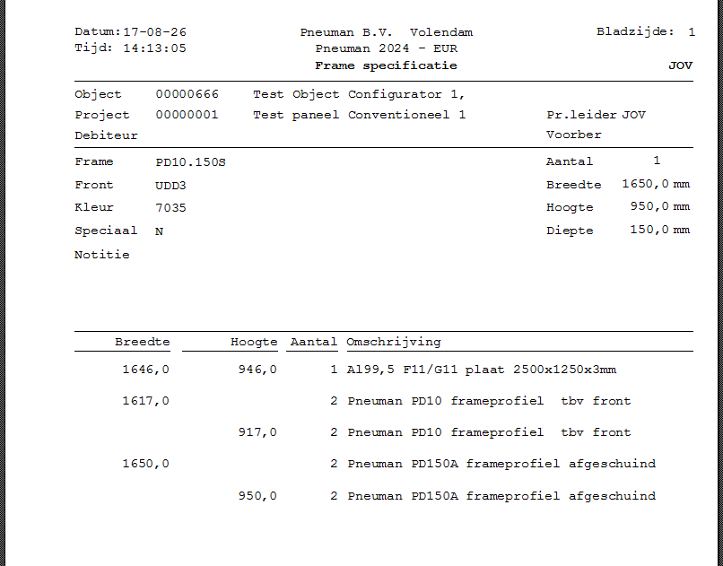
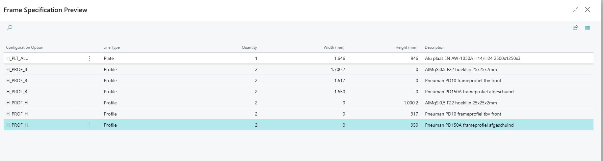

# Handleiding Frame Specification

## Wat doet Frame Specification?

Frame Specification maakt vanuit de bestaande Insight Works-configuratie een
leesbare frame-specificatie voor productie. De app leest de gekozen frame-tak,
berekent de ingestelde profiel- en plaatregels en toont daarvan een afdrukbaar
rapport.

De functie:

- is beschikbaar op **Gesimuleerde**, **Vast geplande** en **Vrijgegeven
  productieorders**;
- gebruikt de bestaande configuratie die bij de productieorder hoort;
- schrijft niets terug naar de configurator, Business Rules, productie-BOM of
  productieorder;
- toont alleen framegegevens waarvoor een ingeschakelde Frame Specification-
  regel bestaat.

> [!NOTE]
> Frame Specification is een productieblad, geen zaagoptimalisatie en geen
> materiaalreservering. De productieordercomponenten blijven leidend voor de
> actuele materiaalbehoefte.

## Benodigde rechten

Normale gebruikers krijgen de permissieset **PNE Frame Specification bekijken**
(`PNE Frame Spec. View`). Alleen beheerders die de rekenregels onderhouden,
krijgen daarnaast **PNE Frame Specification inrichten** (`PNE Frame Spec.`).

## Een frame-specificatie openen

1. Open de juiste gesimuleerde, vast geplande of vrijgegeven productieorder.
2. Controleer bovenaan of het juiste productieordernummer en hoofdartikel zijn
   geopend.
3. Kies **Functies > Frame Specification**.
4. Bekijk het rapport op het scherm.
5. Kies desgewenst **Afdrukken**, **Voorbeeld** of exporteer het rapport naar
   PDF.

Als één unieke configuratie is gevonden, verschijnt het rapport direct. Als de
productieorder naar meerdere verschillende configuraties verwijst, stopt de app
met een duidelijke melding; kies dan niet op goed geluk een configuratie maar
controleer de bronorder of gekoppelde verkoopregel.

## Wat staat er in het rapport?

Het rapport bevat de herkende object- en framegegevens, de ingestelde
framecategorie en de berekende materiaalregels. Breedte en hoogte worden uit de
gekozen frameconfiguratie gelezen. Eventuele correcties komen uit de Pneuman
Frame Specification-regels.

De berekening doorloopt alleen de gekozen `I_FRM`-tak. `I_FRT` wordt als
kopinformatie gebruikt en maakt zelf geen materiaalregel. De oorspronkelijke
configuratie blijft ongewijzigd.

## Voorbeeld vooraf controleren

Een beheerder kan een configuratie eerst zonder productieorder controleren:

1. Zoek de pagina **Test Frame Specification**.
2. Vul de bovenliggende **BMP Configuration ID** in.
3. Kies **Create Preview**.
4. Controleer optie, type, aantal, breedte, hoogte en omschrijving.

De preview is tijdelijk. Er worden geen regels in de productieorder of
configurator opgeslagen.

## Frame-regels inrichten

Deze stap is alleen voor beheerders.

1. Zoek de pagina **Frame Specification Rules**.
2. Maak per gewenste uitvoerregel een regel aan.
3. Vul minimaal in:

   - **Item Category Code**: de frameconfiguratie waarop de regel geldt;
   - **Configuration Option**: de optie die de regel activeert, bijvoorbeeld
     een profiel- of plaatkeuze;
   - **Component Type**: één artikel of een component uit een Productie-BOM;
   - **Component No.** en zo nodig **Production BOM No.**;
   - **Description** en **Quantity**;
   - **Use Width** en/of **Use Height**;
   - de afgesproken breedte- en hoogtecorrectie in millimeters;
   - **Sort Order**;
   - **Enabled**.

4. Controleer de regel met **Test Frame Specification**.
5. Open daarna een echte gesimuleerde productieorder en controleer het Word-
   rapport.

> [!WARNING]
> Pas een bestaande regel niet aan terwijl hetzelfde configuratietype al in
> productie wordt gebruikt zonder eerst een voorbeeld te controleren. Een
> regelwijziging beïnvloedt nieuwe rapportberekeningen, maar wijzigt geen reeds
> opgeslagen IWX-configuratie.

## Veelvoorkomende meldingen

| Melding of situatie | Betekenis | Oplossing |
| --- | --- | --- |
| Frame Specification staat niet onder Functies | De appversie of permissieset ontbreekt | Publiceer/installeer de actuele Frame-app en wijs `PNE Frame Spec. View` toe |
| Geen configuratie met `I_FRM` gevonden | De productieorder is niet eenduidig aan een frameconfiguratie gekoppeld | Controleer bronnummer, hoofdartikel en gekoppelde verkoopregel |
| Meerdere configuraties gevonden | Meer dan één verschillende configuratie past bij de order | Herstel de bronkoppeling; de app kiest bewust niet de eerste |
| Een materiaalregel ontbreekt | De optie komt niet voor of de Frame Specification-regel is uitgeschakeld/onvolledig | Controleer de optie en de beheerregel met de preview |
| Breedte of hoogte is onverwacht | De gekozen configuratiewaarde of correctie wijkt af | Controleer `I_WDTH`, `I_HGHT` en de ingestelde correctie |

## Snelle acceptatiecontrole na een update

- [ ] De actie staat op alle drie productieorderstatussen.
- [ ] Een bekende BMP-productieorder opent zonder keuzemelding.
- [ ] Object, frame, breedte en hoogte zijn herkenbaar.
- [ ] De preview en het Word-rapport bevatten dezelfde materiaalregels.
- [ ] Een gebruiker met alleen de kijkrol kan geen Frame Specification-regels
  wijzigen.
- [ ] De IWX-configuratie en productieorder zijn na openen/afdrukken niet
  gewijzigd.
